# Architektura systému FlightLog

**Verze dokumentu:** 1.0  
**Datum:** 06-05-2026  
**Autoři:** Architektonický tým  
**Stav:** Platný

---

## Obsah

1. [Přehled systému](#1-přehled-systému)
2. [C4 Model — Úroveň 1: Kontext](#2-c4-model--úroveň-1-kontext)
3. [C4 Model — Úroveň 2: Kontejnery](#3-c4-model--úroveň-2-kontejnery)
4. [C4 Model — Úroveň 3: Komponenty](#4-c4-model--úroveň-3-komponenty)
5. [Popis frontendu](#5-popis-frontendu)
6. [Popis backendu](#6-popis-backendu)
7. [Databázové schéma](#7-databázové-schéma)
8. [Datové toky](#8-datové-toky)
9. [Integrace s ClubDB](#9-integrace-s-clubdb)
10. [Bezpečnostní architektura](#10-bezpečnostní-architektura)
11. [Logování a monitoring (ELK)](#11-logování-a-monitoring-elk)
12. [Nasazení a infrastruktura](#12-nasazení-a-infrastruktura)
13. [Klíčová architektonická rozhodnutí (ADR)](#13-klíčová-architektonická-rozhodnutí-adr)

---

## 1 Přehled systému

FlightLog je webová aplikace typu **PWA (Progressive Web App)** určená pro evidenci letů na malém letišti. Nahrazuje papírovou evidenci elektronickým systémem s podporou offline provozu.

### Technologický zásobník

| Vrstva | Technologie |
|---|---|
| Frontend | Statické HTML/JS/CSS (PWA), Service Worker, IndexedDB |
| Backend | Kotlin 2.1, Spring Boot 3.4, Java 21 |
| Databáze | PostgreSQL 16 |
| ORM / migrace | Hibernate (JPA), Flyway |
| Bezpečnost | Spring Security, BCrypt (cost 12) |
| Cache | Caffeine (krátkodobá), PostgreSQL snapshot (dlouhodobá) |
| HTTP klient | Spring RestClient |
| Retry | Spring Retry |
| Logování | Logback + Logstash Encoder → Logstash → Elasticsearch + Kibana |
| Build | Gradle (Kotlin DSL) |
| Kontejnerizace | Docker, Docker Compose |
| Orchestrace | Kubernetes (kustomize) |

---

## 2 C4 Model — Úroveň 1: Kontext

Diagram zobrazuje systém FlightLog v kontextu jeho uživatelů a externích systémů.

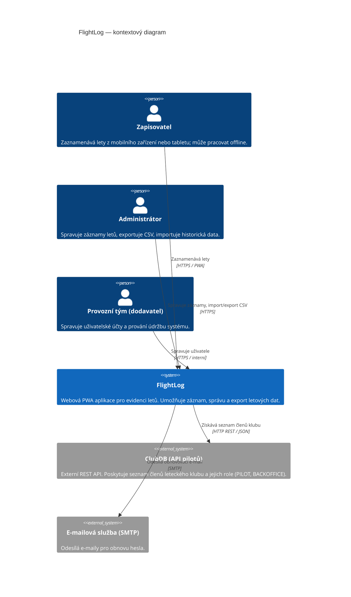

### Klíčové vztahy

- **Zapisovatel → FlightLog**: přistupuje přes webový prohlížeč na mobilním zařízení; aplikace je nainstalovaná jako PWA a funguje i offline.
- **Administrátor → FlightLog**: pracuje na desktopu, využívá přehledové tabulky, filtry, CSV import/export.
- **FlightLog → ClubDB**: jednosměrná integrace (pouze čtení); systém ověřuje roli pilota a zjišťuje členství v klubu.
- **FlightLog → SMTP**: zasílání jednorázových tokenů pro obnovu hesla.

---

## 3 C4 Model — Úroveň 2: Kontejnery

Diagram zobrazuje nasaditelné kontejnery systému a jejich vzájemné komunikace.

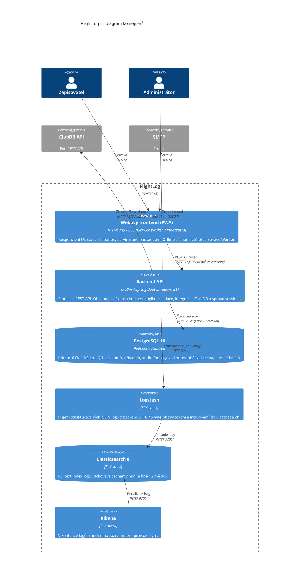

### Popis kontejnerů

| Kontejner | Odpovědnost |
|---|---|
| **Webový frontend (PWA)** | Statické soubory (HTML/JS/CSS) servírované Springem z `classpath:/static/`. Service Worker zajišťuje offline caching a odložené synchronizace. |
| **Backend API** | Jediný vstupní bod pro veškerou logiku. Verifikuje oprávnění, validuje vstupy, orchestruje operace přes vrstvu Facade → Operation → Repository. |
| **PostgreSQL 16** | ACID transakce, referenční integrita, snapshot tabulka pro ClubDB cache, auditní log. |
| **ELK (Logstash + ES + Kibana)** | Centralizovaný agregátor logů. Backend odesílá JSON události přes TCP; Kibana slouží jako UI pro monitoring a audit. |

---

## 4 C4 Model — Úroveň 3: Komponenty

### 4.1 Komponenty backendu

```mermaid
C4Component
    title Backend — diagram komponent

    Container_Boundary(backend, "Backend API (Spring Boot)") {

        Component(securityFilter, "Security Filter Chain\n(Spring Security)", "Servlet Filter", "Ověřuje autenticitu a autorizaci každého požadavku na základě HTTP session a rolí (WRITER, ADMIN).")
        Component(requestFilter, "RequestLoggingFilter", "OncePerRequestFilter", "Plní MDC kontext (requestId, user, ip, path) pro strukturované logování.")

        Component(authCtrl, "AuthController", "REST Controller\n/api/auth/**", "Přihlášení, odhlášení, změna a obnova hesla.")
        Component(writerCtrl, "WriterFlightController", "REST Controller\n/api/writer/**", "Přijímá požadavky zapisovatele: vzlet, přistání.")
        Component(adminCtrl, "AdminFlightController", "REST Controller\n/api/admin/**", "Přijímá požadavky administrátora: přehled, export, import, edit, smazání.")
        Component(airplaneCtrl, "AirplaneController", "REST Controller\n/airplane/**", "CRUD pro letadla (rozšiřující legacy endpointy).")
        Component(userCtrl, "UserController", "REST Controller\n/user/**", "Správa uživatelských profilů.")

        Component(flightFacade, "FlightFacade", "Spring Component", "Orchestruje operace nad lety (vzlet, přistání, export, reporty).")
        Component(airplaneFacade, "AirplaneFacade", "Spring Component", "Orchestruje operace nad letadly.")
        Component(personFacade, "PersonFacade", "Spring Component", "Orchestruje operace nad osobami/piloty.")

        Component(takeoffOp, "TakeoffOperation", "Operation", "Business logika vzletu: validace, párování vlek ↔ kluzák, uložení.")
        Component(landOp, "LandOperation", "Operation", "Business logika přistání: validace času, dopočet doby letu.")
        Component(exportOp, "GetExportToCsvOperation", "Operation", "Generuje CSV soubor dle aktuálních filtrů.")
        Component(importOp, "ImportOperation", "Operation", "Validuje a importuje CSV soubor s historickými daty.")

        Component(clubUserSvc, "ClubUserService", "Spring Service\n@Primary", "FR-12/NFR-03: Volá ClubDB s timeoutem 15 s a retry 2×. Krátkodobá Caffeine cache (TTL 60 s) + dlouhodobý PostgreSQL snapshot.")
        Component(degraded, "DegradedModeHolder", "Request-scoped Bean", "Označí request jako 'degradovaný' při fallbacku na cache.")
        Component(authSvc, "AuthService", "Spring Service", "Logika přihlášení, generování reset tokenů, BCrypt verifikace.")
        Component(loginAttemptSvc, "LoginAttemptService", "Spring Service", "NFR-06: Počítá neúspěšné pokusy o přihlášení; aktivuje CAPTCHA ochranu po 3 pokusech.")
        Component(auditSvc, "AuditService", "Spring Service", "NFR-09: Zápisuje audit záznamy do DB a loguje je. Plánovaný úklid >12 měsíců starých záznamů.")

        Component(flightRepo, "FlightRepository", "JPA Repository", "CRUD nad tabulkou flights. Vlastní dotazy pro reporty a filtrování.")
        Component(personRepo, "PersonRepository", "JPA Repository", "CRUD nad tabulkou persons.")
        Component(airplaneRepo, "AirplaneRepository", "JPA Repository", "CRUD nad tabulkou airplanes.")
        Component(auditRepo, "AuditLogJpa", "JPA Repository", "CRUD nad tabulkou audit_log.")
        Component(snapshotRepo, "ClubUserSnapshotJpa", "JPA Repository", "Čte a zapisuje dlouhodobou cache ClubDB (tabulka club_user_snapshots).")
    }

    Rel(securityFilter, authCtrl, "Přepouští /api/auth/**")
    Rel(securityFilter, writerCtrl, "Autorizuje WRITER/ADMIN")
    Rel(securityFilter, adminCtrl, "Autorizuje ADMIN")

    Rel(authCtrl, authSvc, "Deleguje")
    Rel(authCtrl, auditSvc, "Loguje přihlášení")
    Rel(authSvc, loginAttemptSvc, "Kontroluje pokusy")

    Rel(writerCtrl, flightFacade, "Deleguje")
    Rel(adminCtrl, flightFacade, "Deleguje")
    Rel(adminCtrl, airplaneFacade, "Deleguje")
    Rel(adminCtrl, auditSvc, "Loguje akce")

    Rel(flightFacade, takeoffOp, "Volá")
    Rel(flightFacade, landOp, "Volá")
    Rel(flightFacade, exportOp, "Volá")
    Rel(flightFacade, importOp, "Volá")

    Rel(takeoffOp, clubUserSvc, "Ověřuje roli pilota")
    Rel(takeoffOp, flightRepo, "Ukládá let")
    Rel(takeoffOp, auditSvc, "Audituje")

    Rel(clubUserSvc, degraded, "Označuje degradovaný režim")
    Rel(clubUserSvc, snapshotRepo, "Fallback / refresh snapshotu")
```

### 4.2 Vrstvená architektura backendu

```
Controller  ──►  Facade  ──►  Operation  ──►  Repository  ──►  PostgreSQL
                   │
                   └──►  Service (ClubUserService, AuditService, AuthService)
```

| Vrstva | Odpovědnost |
|---|---|
| **Controller** | Deserializace HTTP požadavků, mapování na modely, HTTP odpovědi. Žádná business logika. |
| **Facade** | Kompoziční bod — orchestruje volání Operation/Repository, neobsahuje kód pracující s entitami databáze. |
| **Operation** | Atomická business transakce (vzlet, přistání, export, import). Obsahuje validační a výpočetní logiku. |
| **Repository** | Abstrakce nad JPA. Překládá doménové dotazy na SQL. |
| **Entity** | JPA entity mapované 1:1 na databázové tabulky. Neobsahují business logiku. |

---

## 5 Popis frontendu

### 5.1 Technologie

Frontend je implementován jako sada statických HTML/JS/CSS souborů servírovaných přímo z Spring Boot (`classpath:/static/`). Není přítomen žádný moderní JS framework — jde o záměrně jednoduché rozhraní s minimálními závislostmi.

### 5.2 PWA a offline podpora

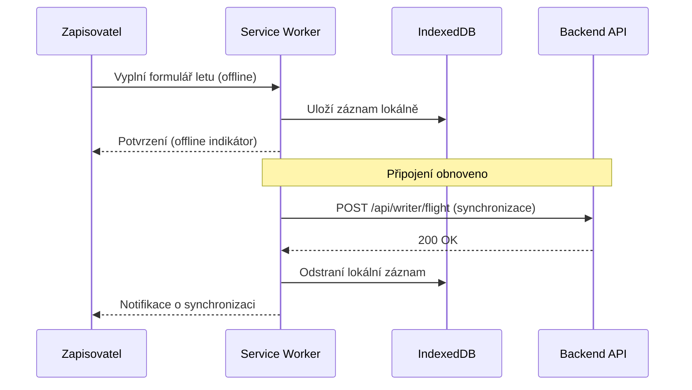

**Klíčové části PWA:**

| Soubor | Účel |
|---|---|
| `manifest.webmanifest` | Metadata aplikace pro instalaci na domovskou obrazovku |
| `service-worker.js` | Cache statických zdrojů, zachytávání požadavků, odložená synchronizace |
| `pwa-register.js` | Registrace Service Workera při načtení stránky |
| `sw-reset.html` | Záchranná stránka pro reset SW při závažné chybě |

### 5.3 Moduly UI

```
static/
├── index.html          ← Vstupní bod (Administrátor / splash)
├── login.html          ← Přihlašovací obrazovka (oba uživatelé)
├── writer/
│   └── new-flight.html ← Formulář záznamu letu (Zapisovatel)
└── admin/
    └── flights.html    ← Přehledová tabulka letů (Administrátor)
```

### 5.4 Komunikace s backendem

- Všechny API volání probíhají přes `fetch()` na relativní URL `/api/...`
- Autentizace je udržována pomocí HTTP session cookie `FLSESSION` (`HttpOnly`, `SameSite=Lax`)
- Při degradovaném režimu (ClubDB nedostupné) backend vrátí hlavičku a frontend zobrazí varování „Data nemusí být aktuální"

---

## 6 Popis backendu

### 6.1 Spring Boot aplikace

Backend je **stateless REST API** s session uloženou in-memory (výchozí konfigurace). Session timeout je 30 minut inaktivity.

> **Poznámka k produkčnímu nasazení:** Komentář v `k8s/50-app.yaml` upozorňuje, že při více replikách je nutné přesunout session store mimo paměť JVM (např. Redis) nebo zajistit sticky sessions na loadbalanceru.

### 6.2 Klíčové Spring konfigurace

| Konfigurace | Třída | Popis |
|---|---|---|
| Bezpečnost | `SecurityConfig` | Filter chain, role WRITER/ADMIN, BCrypt encoder |
| HTTP request log | `RequestLoggingFilter` | MDC: `requestId`, `user`, `role`, `ip`, `method`, `path`, `status`, `durationMs` |
| CORS | `WebConfig` | Povolené originy přes `ALLOWED_ORIGINS` env proměnnou |
| Dev seeder | `DevDataSeeder` | Generuje testovací data v `dev` profilu |
| Cache | `AppConfig` | Caffeine konfigurace krátkodobé cache |

### 6.3 Retry mechanismus pro ClubDB

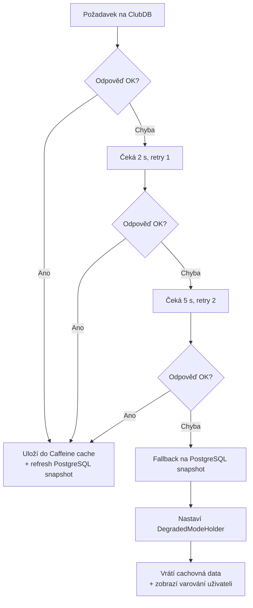

### 6.4 Operace — příklad: Vzlet (TakeoffOperation)

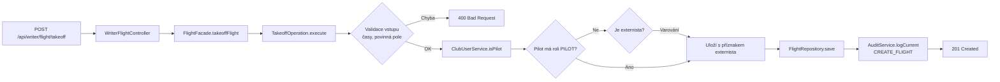

---

## 7 Databázové schéma

### 7.1 Entitně-relační diagram

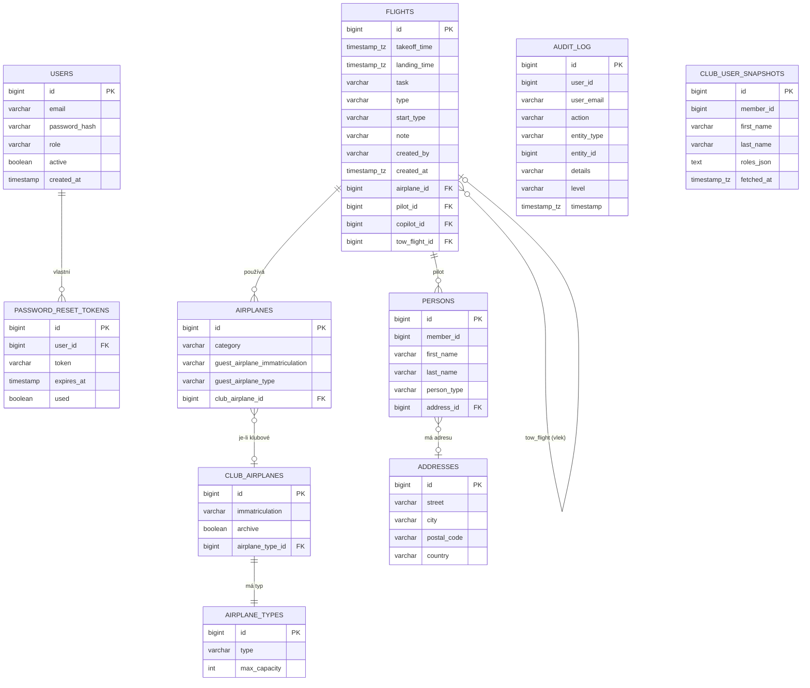

### 7.2 Klíčové databázové vlastnosti

- **Primární klíče**: `BIGINT GENERATED BY DEFAULT AS IDENTITY` (PostgreSQL sekvence)
- **Constrainty**: CHECK constrainty na enum-like sloupce (`category`, `type`, `start_type`, `person_type`)
- **Cizí klíče**: referenční integrita vynucena na DB úrovni (NFR-08)
- **Časové zóny**: všechny timestamp sloupce typu `TIMESTAMP WITH TIME ZONE`
- **Migrace**: spravuje Flyway (`V1__baseline.sql`, `V2__indexes.sql`); Hibernate nastaven na `validate`
- **Audit**: tabulka `audit_log` uchovává záznamy minimálně 12 měsíců (plánovaný úklid v `AuditService`)

### 7.3 Flyway migrace

```
db/migration/
├── V1__baseline.sql   ← Kompletní baseline schéma
└── V2__indexes.sql    ← Výkonnostní indexy
```

---

## 8 Datové toky

### 8.1 Přihlášení uživatele

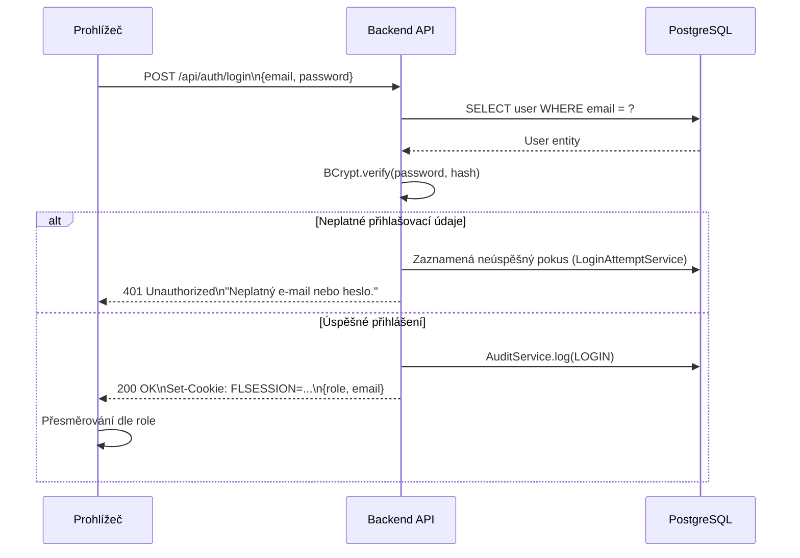

### 8.2 Záznam letu (Vzlet + Přistání)

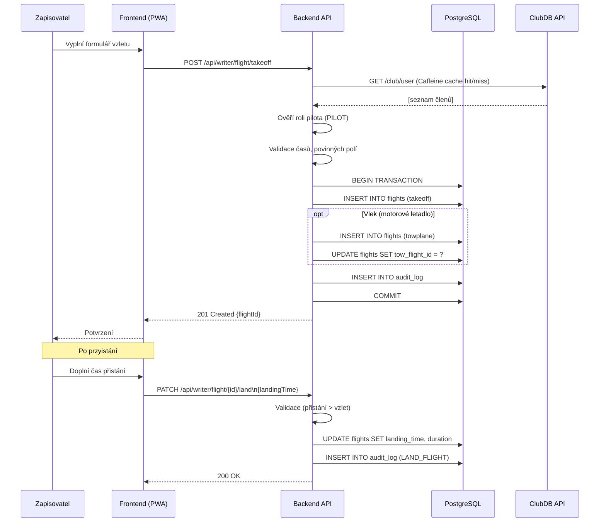

### 8.3 Export CSV

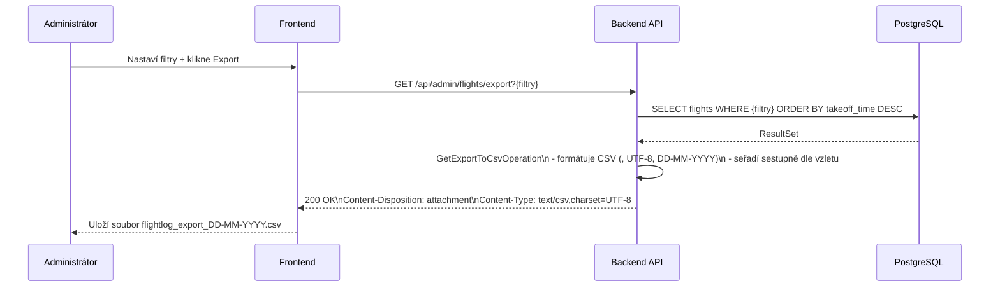

### 8.4 Import CSV

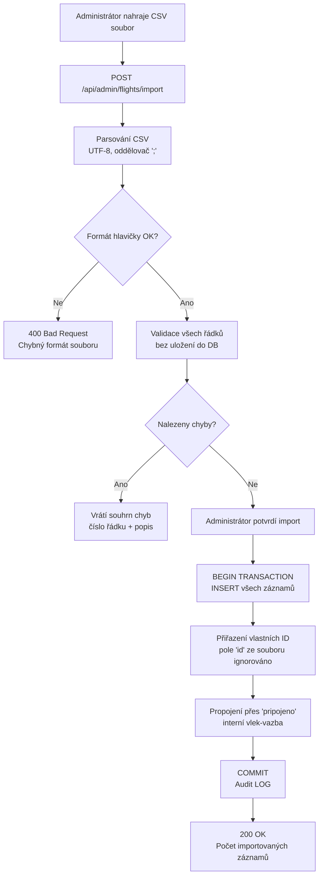

---

## 9 Integrace s ClubDB

### 9.1 Technické parametry

| Parametr | Hodnota |
|---|---|
| Základní URL | `http://vyuka.profinit.eu:8080/` |
| Endpoint | `GET /club/user` |
| Protokol | HTTP REST, JSON |
| Timeout | 15 sekund (connect + read) |
| Retry | 2× (2 s a 5 s prodleva) |
| Krátkodobá cache | Caffeine, TTL 60 s, in-memory |
| Dlouhodobá cache | PostgreSQL tabulka `club_user_snapshots` |

### 9.2 Datová struktura odpovědi ClubDB

```json
[
  {
    "memberId": 42,
    "firstName": "Jan",
    "lastName": "Novák",
    "roles": ["PILOT", "BACKOFFICE"]
  }
]
```

### 9.3 Cache strategie

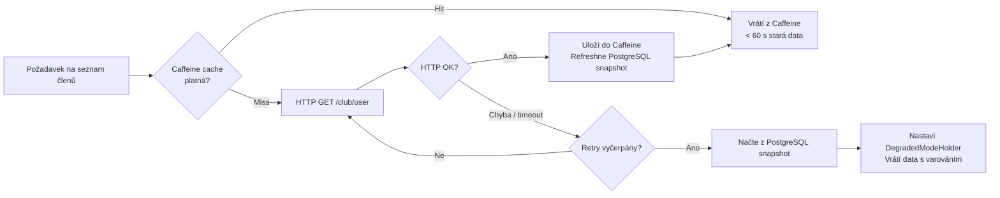

### 9.4 Mapování rolí

| Role v ClubDB | Interpretace ve FlightLog |
|---|---|
| `PILOT` | Pilot je platný člen klubu s oprávněním létat |
| `BACKOFFICE` | Člen klubu bez pilotního oprávnění |
| *(neexistuje v ClubDB)* | Externista — let zapsán, ale uživatel informován |

### 9.5 Degradovaný režim

Při nedostupnosti ClubDB přejde systém do **degradovaného online režimu**:
- Data o pilotech jsou načtena z PostgreSQL snapshot (`club_user_snapshots`)
- Odpovědná třída: `DegradedModeHolder` (request-scoped Spring bean)
- Frontend obdrží indikaci v odpovědi a zobrazí: „Data nemusí být aktuální"
- Záznamy letů lze i v tomto režimu normálně ukládat

---

## 10 Bezpečnostní architektura

### 10.1 Autentizace a session

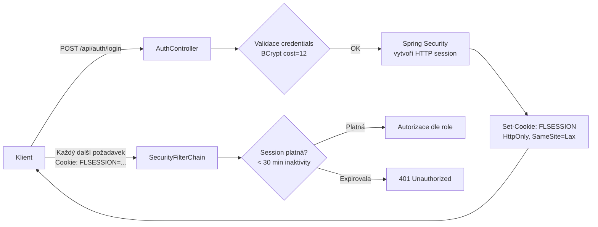

### 10.2 Autorizace — matice přístupu

| Endpoint | WRITER | ADMIN |
|---|:---:|:---:|
| `POST /api/writer/flight/takeoff` | ✓ | ✓ |
| `PATCH /api/writer/flight/{id}/land` | ✓ | ✓ |
| `GET /api/admin/flights` | ✗ | ✓ |
| `GET /api/admin/flights/export` | ✗ | ✓ |
| `POST /api/admin/flights/import` | ✗ | ✓ |
| `PUT /api/admin/flights/{id}` | ✗ | ✓ |
| `DELETE /api/admin/flights/{id}` | ✗ | ✓ |
| `GET /actuator/**` | ✗ | ✓ |
| `GET /api/auth/**` | veřejné | veřejné |

### 10.3 Ochrana hesel

- Algoritmus: **BCrypt**, cost factor 12
- Reset hesla: jednorázový token, platnost max. 24 hodin, odeslán na e-mail
- Po **3 neúspěšných pokusech**: aktivace CAPTCHA ochrany (`LoginAttemptService`)

### 10.4 Transportní vrstva

- Veškerá komunikace probíhá přes **HTTPS (TLS 1.2+)**; HTTP není podporováno
- CORS politika konfigurována přes proměnnou prostředí `ALLOWED_ORIGINS`
- CSRF ochrana Spring Security pro session-based autentizaci

---

## 11 Logování a monitoring (ELK)

### 11.1 Architektura logování

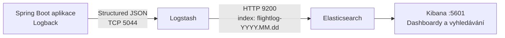

### 11.2 Typy logovaných událostí

| `event_kind` | Zdroj (logger pattern) | Popis |
|---|---|---|
| `audit` | `*.audit.*` | Vytvoření, editace, smazání letu; přihlášení |
| `access` | `*.access` | HTTP access log (RequestLoggingFilter) |
| `app` | ostatní | Aplikační logy (INFO/WARN/ERROR) |

### 11.3 MDC kontextová pole (access log)

Každý HTTP požadavek nese v MDC:

| Pole | Popis |
|---|---|
| `requestId` | UUID požadavku pro korelaci |
| `user` | E-mail přihlášeného uživatele |
| `role` | Role uživatele (WRITER/ADMIN) |
| `ip` | IP adresa klienta |
| `method` | HTTP metoda |
| `path` | URL cesta |
| `status` | HTTP status odpovědi |
| `durationMs` | Doba zpracování v ms |

### 11.4 Audit log

`AuditService` zapisuje do tabulky `audit_log`:

| Pole | Popis |
|---|---|
| `user_email` | Identifikátor uživatele |
| `timestamp` | Čas akce |
| `action` | Typ operace (LOGIN, CREATE_FLIGHT, EDIT_FLIGHT, DELETE_FLIGHT, ...) |
| `entity_type` | Typ entity (Flight, User, ...) |
| `entity_id` | ID entity |
| `level` | INFO / WARN / ERROR |

Záznamy jsou uchovávány **minimálně 12 měsíců** (plánovaný úklid každý den v 03:30).

---

## 12 Nasazení a infrastruktura

### 12.1 Lokální vývoj (Docker Compose)

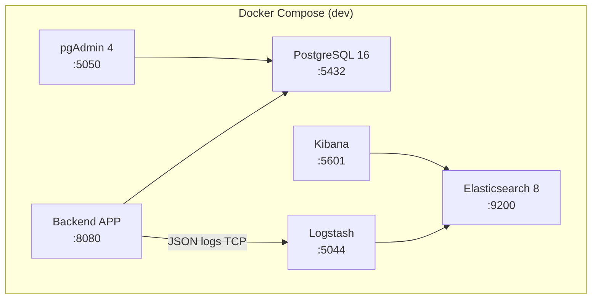

### 12.2 Produkční nasazení (Kubernetes)

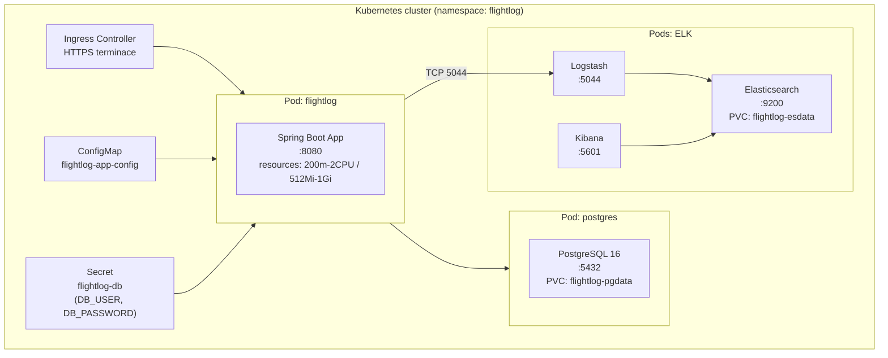

### 12.3 Kubernetes manifesty

| Soubor | Obsah |
|---|---|
| `00-namespace.yaml` | Namespace `flightlog` |
| `05-config.yaml` | ConfigMap s env proměnnými aplikace |
| `10-postgres.yaml` | Deployment + Service + PVC pro PostgreSQL |
| `20-elasticsearch.yaml` | Deployment + PVC pro Elasticsearch |
| `30-logstash.yaml` | Deployment pro Logstash |
| `40-kibana.yaml` | Deployment pro Kibanu |
| `50-app.yaml` | Deployment + Service + (Ingress) pro aplikaci |
| `kustomization.yaml` | Kustomize agregace |

### 12.4 Health checks

| Endpoint | Typ | Popis |
|---|---|---|
| `/actuator/health/readiness` | Readiness probe | Kontrola DB + aplikace připravenosti |
| `/actuator/health/liveness` | Liveness probe | Kontrola, že JVM běží |
| `/actuator/health` | Veřejný | Obecný stav (přístupný bez autentizace) |

### 12.5 Horizontální škálování

Aktuální konfigurace používá **1 repliku** s in-memory session. Pro škálování na více replik je nutné:

1. Přesunout HTTP session do distribuovaného store (doporučeno: **Redis** přes `spring-session-data-redis`)
2. Nebo nakonfigurovat sticky sessions na Ingress úrovni
3. PostgreSQL musí zůstat jako single primary (čtení lze škálovat přes read repliky)

---

## 13 Klíčová architektonická rozhodnutí (ADR)

### ADR-01: Kotlin + Spring Boot jako backend

**Kontext:** Výběr technologie pro implementaci REST API.

**Rozhodnutí:** Kotlin 2.1 na JVM 21, Spring Boot 3.4.

**Důvody:**
- Null-safety na úrovni jazyka redukuje NullPointerException
- Plná kompatibilita s Java ekosystémem (Spring, Hibernate, Flyway)
- Korutiny dostupné pro případné budoucí async operace
- Tým má zkušenosti s JVM stackem

**Trade-offs:** Delší cold start oproti Go/Node, vyšší paměťová náročnost.

---

### ADR-02: Statické HTML/JS/CSS místo frontend frameworku

**Kontext:** Volba implementace frontendu.

**Rozhodnutí:** Servu statické soubory přímo ze Spring Bootu, žádný React/Vue/Angular.

**Důvody:**
- Minimální počet uživatelů, jednoduché UI bez komplexních interakcí
- Žádná potřeba build pipeline pro frontend
- Menší attack surface (žádné npm závislosti)
- Jednoduché nasazení do jediného JAR/Dockeru

**Trade-offs:** Obtížnější údržba při rozrůstání UI, žádný typesafety v JS, omezený DX.

---

### ADR-03: PostgreSQL snapshot jako dlouhodobá cache ClubDB

**Kontext:** ClubDB může být nedostupné. Je potřeba záložní zdroj dat o pilotech.

**Rozhodnutí:** Při každém úspěšném volání ClubDB uložit snapshot do PostgreSQL tabulky `club_user_snapshots`. Při nedostupnosti API použít tento snapshot.

**Důvody:**
- Jednotné úložiště (žádná závislost na Redis/Memcached)
- Data přežijí restart aplikace
- Transakční konzistence s ostatními daty

**Trade-offs:** Snapshot může být zastaralý. Přijatelné dle NFR-03 (uživatel je informován o degradovaném režimu).

---

### ADR-04: HTTP Session místo JWT tokenů

**Kontext:** Mechanismus udržení autentizačního stavu.

**Rozhodnutí:** HTTP Session (cookie `FLSESSION`), žádné JWT.

**Důvody:**
- Okamžitá invalidace session při odhlášení nebo timeout
- Jednodušší implementace bez správy kryptografických klíčů
- Malý počet uživatelů — session škálovatelnost není priorita (viz ADR-05)

**Trade-offs:** Komplikuje horizontální škálování (viz ADR-05). JWT by umožnilo stateless ověřování.

---

### ADR-05: Single-replica default s cestou na Redis session

**Kontext:** NFR-12 vyžaduje horizontální škálovatelnost.

**Rozhodnutí:** Výchozí konfigurace je 1 replika s in-memory session. Produkční dokument (komentář v `50-app.yaml`) explicitně popisuje cestu na Redis.

**Důvody:**
- Letiště má malý provoz — 1 replika je dostatečná pro 99 % provozu
- Odložení komplexity Redis na okamžik skutečné potřeby
- Kubernetes Deployment umožní rychlou změnu počtu replik

**Trade-offs:** Pokud bude nutná okamžitá HA (high availability), příprava na Redis bude vyžadovat dodatečné úsilí.

---

### ADR-06: ELK stack pro centralizované logování

**Kontext:** NFR-09 vyžaduje audit log s retencí 12 měsíců, kategorizaci INFO/WARN/ERROR.

**Rozhodnutí:** Structured JSON logging (Logback + logstash-logback-encoder) → Logstash TCP → Elasticsearch → Kibana.

**Důvody:**
- Fulltext prohledávání logů v Kibaně
- Agregace a dashboardy pro monitoring
- Oddělení auditního záznamu od aplikační DB
- Standardní enterprise řešení

**Trade-offs:** Operační složitost — 3 další kontejnery. Pro malý systém by mohl postačit file-based logging, ale ELK poskytuje lepší přehlednost a splňuje NFR-09.

---

### ADR-07: Flyway pro správu DB schématu, Hibernate validate

**Kontext:** Evoluce databázového schématu v čase.

**Rozhodnutí:** Flyway spravuje migrace (`V<N>__*.sql`), Hibernate nastaven na `ddl-auto=validate`.

**Důvody:**
- Verzionované, reverzibilní migrace v git repozitáři
- Hibernate validate zabrání spuštění aplikace při nesouladu entity ↔ schéma
- Explicitní SQL migrace jsou přezkoumatelné a nasaditelné nezávisle

**Trade-offs:** Každá změna entity vyžaduje nový SQL soubor. Větší overhead při vývoji, ale bezpečnější pro produkci.

---

*Dokument byl vygenerován na základě SRS v1.0 a analýzy zdrojového kódu projektu flight-log-kotlin.*
